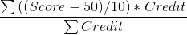

# CalGPA


适用于计算湖南强智科技发展有限公司提供的教务系统的GPA，标准是中国的5分制，登录教务系统后到达“学习完成情况（类别）”，保存页面到本地（假设是：sc.html)


此程序替换规则：

* 及格/合格 -> 65
* 中 -> 75
* 良 -> 85
* 优 -> 95

# 计算方法

* Score -> 百分制实际成绩（如果是文字的话按照上述替换规则自动替换）
* Credit -> 课程所占学分



# 脚本用法

```
python3 cal.py sc.html
```

# License

GNU General Public License v3.0
